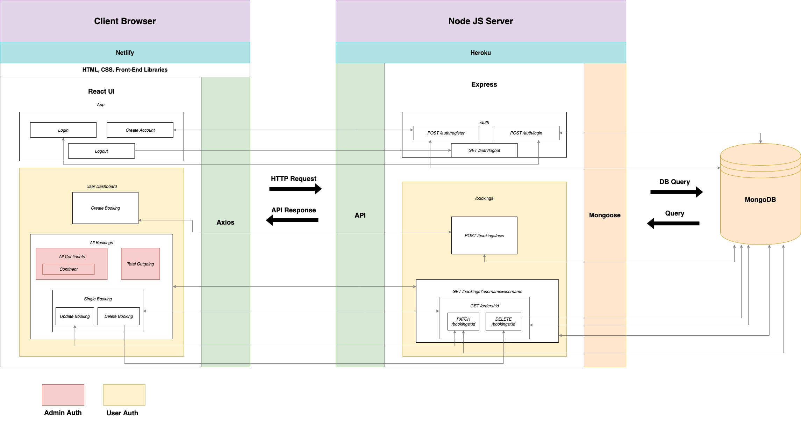
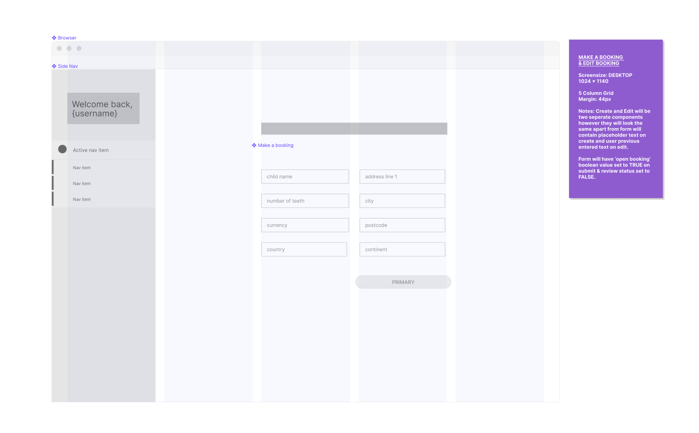

# **Louise Flanagan and Catherine Callcott-Stevens T3A1**
********************************
## **The Tooth Business: MERN full-stack app assignment**
*****************************************

### Client:
- Deployed Staging App: https://development--lucid-wright-444fce.netlify.app/
- Deployed Production: https://lucid-wright-444fce.netlify.app/
### Server:
- Deployed Staging App: https://staging-tooth-inc-server.herokuapp.com/
- Deployed Production: https://tooth-inc.herokuapp.com/

****************

### Purpose

We were approached by our client, the Fairy in Charge(FIC) of Tooth Inc. aka The Tooth Fairy, to create a new full-stack web application. She chose our team to handle this Top Secret project because of our reputation for professionalism and safeguarding sensitive data, mostly thanks to a referral from Santa Claus after we digitised his 'Naughty and Nice List".

This web app will serve two main purposes. Firstly it will be a portal that parents and carers can use to book in a tooth pick-up on the day their child loses a baby tooth. Secondly, it will be a dashboard that the Tooth Fairy can login to manage her company. 

Before hiring us to make this app there was no one place to manage Tooth Inc. If a parent needed to book a tooth pick up they would depend on magic to tell the Tooth Fairy. This worked fine when there were only a few children who believed in her, but as her reputation has grown - mostly thanks to her massive social media following, and the number of children under 6 has shot up to almost 1 billion, magical transmissions became too unpredictable. Furthermore, modern parents are accustomed to excellent customer service. They need an app with a secure login that saves all their data, and an easy booking system where they can book, check, edit and cancel a booking and get immediate confirmation that they were successful.

While moving from an esoteric to a more practical management system the Tooth Fairy realised, in collaboration with us, that she could streamline her company by moving it online. We decided on a highly secure dashboard where she can view all the daily orders, how many dollars will be outgoing, and the total Fairy Dollar balance of Tooth Inc. It will also show how many deliveries will be done on each continent and give an average rating of each region's manager based on parent reviews. 
*********

#### Target Audience

This app will be aimed at parents and carers of children of teeth losing age, as well as the FIC of Tooth Inc.
*********

#### User Stories

1. As a busy parent I need to organise a Tooth Fairy pick up quickly and easily. Being able to login to a portal where all my details are saved saves me a lot of time.

2. As a parent of an anxious child I need the peace of mind that when I book the Tooth Fairy there will definitely be a pick-up that same night. My child would be so disappointed to find the tooth still under her pillow in the morning, so I need to receive confirmation that my booking has been successful.

3. As the parent in a chaotic family, we have been known to lose the occasional tooth before the tooth fairy can collect it. In these cases it is reassuring to know that I can login to my personal portal and cancel a tooth collection. 

4. As a parent of twins my boys do everything together, sometimes even lose teeth. I need to be able to update my pick-up order from to one to two or more teeth.

5. As a parent that wants only the best for my child I need to be able to rate and review the service I have received from the Tooth Fairy.

6. As the Fairy in Charge (FIC) of Tooth Inc, an online dashboard is imperative to the successful running of one of the biggest organizations in Fairyland. 

7. As the Fairy In Charge, the most important thing for me is that my online portal is secure to protect the Top Secret Secret about what I do with all of the teeth.

8. As the Fairy In Charge I am personally responsible for collecting and 'taking care of' the lost baby teeth of every single child on Earth and I need a responsive environment to manage all of the bookings. 

9. As the Fairy In Charge I need all of the daily tooth pick-ups to be automatically collated into an order summary report for the manager of each continent. 

10. As the Fairy In Charge at Tooth Inc, fiscal responsibility is a huge part of my job. Having a place where I can see with a glance how the organisation is positioned makes it easier for me to focus on what is really important. 

11. As the Fairy in Charge I need to easily see how each continent's manager is rating so I can quickly take steps to maintain my good reputation.
*********

#### Functionality/ Features

The app will have different sets of features for the two target groups. These will be achieved by working in sprints.

**All Users:**
The app will require all users to be authenticated before allowing access to other site features. All users will login via the same login page regardless of administrator status and the same functionality will provide the ability to log out. New accounts for administrators cannot be created via the regular sign up feature and must be created by the Tooth Inc Data Manager for account protection.
- Login
- Logout

**Parents**:
When authorised, parents will have access to a dashboard containing information regarding their bookings. 
- Create an account
- Displayed information that belong to them only
- Previous booking history
- Booking form to create a new booking
- Update a booking
- Delete a booking
- Rate and review a booking via a review form

**Fairy In Charge**:
When administrator authorised, the FIC will have access to an administrator dashboard where she can see information regarding all bookings in the database for the past 24 hours.
- Total order summary
- Total balance
- Daily outgoing 
- Summary of number of bookings by continent 
- Ratings for each continent manager

****************
#### Sprint Planning
At the start of this project we had a scrum until we came up with a concept that we liked. We then sketched out a rough architecture and database plan, and created a Trello board with tasks that need to be completed in order to finish the docs. Each task was allocated according to skill and fair share of the work. 

We will be responsible for marking off the tasks on the Trello as we complete them and adding new tasks as they arise.

We will be working mostly alone, but will pair program some elements using Discord.

The building of the app will be divided into 5 sprints.

**Sprint 1**: Set up front and back-end framework
**Sprint 2**: Login functionality
**Sprint 3**: Create and Read functionality for parent and Tooth Fairy
**Sprint 4**: Delete and Update functionality
**Sprint 5**: Daily outgoings and total balance of FIC's dashboard
**Sprint 6**: Sprinkles if there is no sprint backlog. Styling and email functionality

#### Screenshots

Screenshots of our Trello board can be found organised in date order in the Trello-screenshots directory within this repo.
Please also view the Trello board live here: https://trello.com/b/cEoPCrvP/the-tooth-business

****************
#### Workflow 

We will be working within a Github organisation across 3 repos, one for docs, one for front-end React and back-end node Express. 

For this project we will be using a forking workflow as our version control. We will work on feature branches off of a local development branch and make pull requests into the main repo's development branch. Each merge request will be checked by the other partner before approving the merge. An outline of our workflow is shown in the below diagram. 

We have decided to take theses steps so we can remain agile and add new features throughout the project based on the Fairy in Charge's feedback. We will be using a staging pipeline with Heroku and Netlify to setup CI/CD. Approved pull requests to the main repo development branch will automatically deploy to the staging version of the app and merges into master will automatically deploy to production. We have decided to combine CI/CD with an agile working flow to allow us to sufficiently test the application in various stages of it's lifecycle and protect production code. This will also allow us to get feedback from the Fairy In Charge based on the deployed staging app and make changes before pushing into production.

Testing will be completed at various stages of the build in both the client and the server. Automated unit tests will be written and recorded for the server in a TDD fashion before pushing code to Origin. The staged deploys of server and client will both be manual tested independently and automated integration tested with Cypress once they are linked. Manual and automated tests will also be run and recorded on the production version of the application.

****************

#### Dataflow Diagram

****************

#### Application Architecture Diagram

****************

#### Wireframes

Wireframes can also be viewed in higher definition via Figma: https://bit.ly/31OHS3K

##### Desktop - Sign Up

##### Tablet & Mobile - Sign Up

##### Desktop - Login

##### Tablet & Mobile - Login

##### Desktop - Admin Dashboard

##### Tablet & Mobile- Admin Dashboard

##### Desktop - Parent Dashboard

##### Tablet & Mobile - Parent Dashboard

##### Desktop - Make a booking / Edit a booking

##### Tablet & Mobile - Make a booking / Edit a booking

*********

#### Tech Stack:

**Front-end**: HTML5, CSS3, REACT.JS, Javascript, JSX, AXIOS, Material-ui.

**Back-end**: Node, ExpressJS

**Database**: MongoDB, Mongoose

**Deployment**: 
Back-end: Heroku
Front-end: Netlify

**Testing**: Cypress, Mocha

**Project-management tools**: Trello, Discord

**Utilities**: Draw.io, Figma, Visual Paradigm

**DevOps**: Git, Github, VS Code

